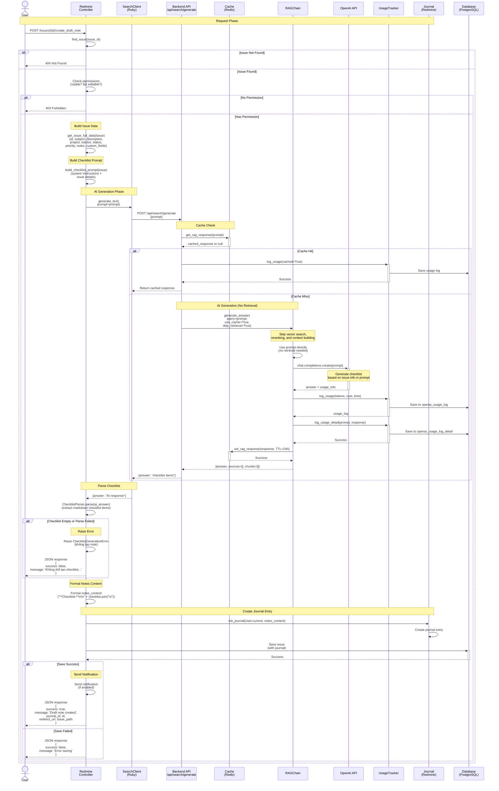

# Create Draft Note Sequence Diagram

Tài liệu mô tả quy trình tạo draft note với AI-generated checklist cho Redmine issue.

## Sơ đồ tuần tự (Mermaid)

## Mô tả chi tiết các bước

### 1. Request Phase
- User gửi POST request đến Redmine controller
- Controller tìm issue và kiểm tra quyền (visible && editable)

### 2. Build Issue Data Phase
- Lấy đầy đủ thông tin issue:
  - Basic: id, subject, description
  - Metadata: project, tracker, status, priority
  - Content: notes (5 gần nhất), custom fields

### 3. Build Checklist Prompt Phase
- Tạo prompt với:
  - System instructions: "Bạn là AI assistant tạo checklist..."
  - Issue details: subject, description, project, tracker, status, priority, notes
  - Yêu cầu: Tạo checklist phù hợp với nội dung issue

### 4. AI Generation Phase
- Gọi generate_text với prompt đã tạo
- Bỏ qua vector search và reranking (skip_retrieval=True)
- Gọi AI trực tiếp với prompt đã có đầy đủ issue info
- AI sẽ phân tích issue và tạo checklist items

### 5. Parse Checklist Phase
- Parse AI response để extract checklist items
- Format: Markdown checklist (`- [ ] item`)
- Nếu parse fail hoặc checklist rỗng → raise error và không tạo note

### 6. Format Notes Content Phase
- Format notes content với header "**Checklist:**"
- Join checklist items với newlines

### 7. Create Journal Entry Phase
- Tạo journal entry mới với notes content
- Link với current user
- Save issue (có journal)

### 8. Notification Phase
- Gửi notification nếu enabled
- Trả về response với journal_id và redirect_url

## Error Handling

- **Issue not found**: 404 Not Found
- **No permission**: 403 Forbidden
- **AI generation failed**: Raise `ChecklistGenerationError`, trả về error message, không tạo note
- **Parse failed**: Raise `ChecklistGenerationError`, trả về error message, không tạo note
- **Checklist empty**: Raise `ChecklistGenerationError`, trả về error message, không tạo note
- **AI service error**: Raise `SearchClient::SearchError`, trả về error message, không tạo note
- **Save failed**: Trả về error message

**Lưu ý**: Nếu AI không tạo được checklist hoặc parse thất bại, hệ thống sẽ **không tạo note** và trả về error message cho người dùng. Không có fallback checklist.

## Performance Optimizations

1. **No Retrieval**: Bỏ qua vector search và reranking → nhanh hơn
2. **Direct AI Call**: Gọi AI trực tiếp với prompt đã có → đơn giản hơn
3. **Caching**: Responses được cache 24h (theo prompt)
4. **Error Handling**: Báo lỗi rõ ràng nếu AI không tạo được checklist
5. **Async Notification**: Notification không block response

## Database Tables Used

- `openai_usage_log`: Log usage statistics
- `openai_usage_log_detail`: Log prompt và response chi tiết
- Redmine `issues`, `journals`: Issue và journal entries

## Lưu ý

- Endpoint `/api/search/generate` không sử dụng vector search hay reranking
- Prompt đã chứa đầy đủ thông tin issue, không cần retrieval từ database
- Response format tương tự RAG nhưng `retrieved_chunks` và `sources` luôn là empty arrays

