# Find Related Issues Sequence Diagram

Tài liệu mô tả quy trình tìm kiếm các issues liên quan bằng vector embedding similarity search (không sử dụng AI).

## Sơ đồ tuần tự (Mermaid)

```mermaid
sequenceDiagram
    actor User
    participant Redmine as Redmine<br/>Controller
    participant SearchClient as SearchClient<br/>(Ruby)
    participant API as Backend API<br/>/api/search/issues/{id}/related
    participant DB as Database<br/>(PostgreSQL)
    participant Retriever

    Note over User,Retriever: Request Phase
    User->>Redmine: GET /issues/{id}/find_related_issues
    Redmine->>Redmine: Check permissions<br/>(visible?)
    
    alt No Permission
        Redmine-->>User: 403 Forbidden
    else Has Permission
        Note over Redmine,SearchClient: Prepare Request
        Redmine->>Redmine: Get existing relations<br/>(exclude_ids)
        
        Redmine->>SearchClient: find_related_issues(issue_id, top_k=20, user_id=current_user.id)
        
        Note over SearchClient,API: API Call Phase
        SearchClient->>API: GET /api/search/issues/{issue_id}/related?top_k=20
        
        Note over API,DB: Step 1: Find Source
        API->>+DB: Query Source<br/>(source_type='redmine_issue',<br/>external_id='redmine_issue_{id}')
        DB-->>-API: source or null

        
        alt Source Not Found
            API-->>SearchClient: 404 - Issue not synced
            SearchClient-->>Redmine: SearchError
            Redmine-->>User: Empty list
        else Source Found
            Note over API,DB: Step 2: Get Chunks & Embeddings
            API->>+DB: Query Chunks<br/>(source_id, status='processed')
            DB-->>-API: chunks[]
            
            API->>+DB: Query Embeddings<br/>(chunk_ids, status='active')
            DB-->>-API: embeddings[]
            
            alt No Chunks/Embeddings
                API-->>SearchClient: 404 - No processed chunks
                SearchClient-->>Redmine: SearchError
                Redmine-->>User: Empty list
            else Chunks & Embeddings Found
                Note over API,Retriever: Step 3: Parallel Vector Search<br/>(asyncio.gather + run_in_executor)
                
                par Chạy song song cho tất cả embeddings
                    API->>Retriever: search_by_embedding(<br/>embedding_vector,<br/>top_k=top_k * 2,<br/>exclude_source_ids=[current],<br/>thread_db=SessionLocal())
                and
                    API->>Retriever: search_by_embedding(<br/>embedding_vector,<br/>top_k=top_k * 2,<br/>exclude_source_ids=[current],<br/>thread_db=SessionLocal())
                and
                    API->>Retriever: search_by_embedding(...)
                end
                
                Retriever->>+DB: Vector similarity search<br/>(cosine similarity)<br/>Mỗi thread dùng DB session riêng<br/>(thread-safe)
                DB-->>-Retriever: similar_chunks[]
                Retriever-->>API: similar_chunks[] (từ mỗi thread)
                
                alt No Similar Chunks
                    API-->>SearchClient: {related_issues: [], count: 0}
                    SearchClient-->>Redmine: Empty list
                    Redmine-->>User: Empty list
                else Similar Chunks Found
                    Note over API: Step 4: Merge Results
                    API->>API: Merge results từ tất cả parallel searches<br/>Giữ similarity score cao nhất per chunk<br/>(key: chunk_id hoặc text+source_reference)
                    
                    Note over API: Step 5: Group by Issue
                    API->>API: Extract issue IDs từ source_reference<br/>(format: "redmine_issue_{id}")<br/>Group chunks theo issue<br/>Giữ similarity score cao nhất per issue<br/>Trích xuất subject từ heading hoặc chunk text<br/>(regex: "Issue #id: Subject")
                    
                    Note over API: Step 6: Select Top Issues
                    API->>API: Sort issues theo similarity_score (desc)<br/>Select top_k issues<br/>(không dùng AI, chỉ dùng similarity scores)
                    
                    Note over API: Step 7: Build Response
                    API->>API: Build issue data<br/>(issue_id, similarity_score,<br/>similarity_percentage, subject)
                    
                    API-->>SearchClient: {<br/>issue_id,<br/>related_issues: [{<br/>issue_id, similarity_score,<br/>similarity_percentage, subject<br/>}],<br/>count, response_time_ms<br/>}
                    
                    Note over SearchClient,Redmine: Step 8: Filter & Format
                    SearchClient->>SearchClient: Parse API response
                    SearchClient->>SearchClient: Filter excluded IDs<br/>(existing relations)
                    
                    SearchClient->>+DB: Query Issues<br/>(find_by_id, check visible)
                    DB-->>-SearchClient: issue objects
                    
                    SearchClient->>SearchClient: Filter by project<br/>(same project only)<br/>Limit to 5 issues
                    SearchClient->>SearchClient: Format for JSON<br/>(add similarity scores)
                    
                    SearchClient-->>Redmine: related_issues[]
                    
                    Redmine-->>User: JSON response<br/>{success: true,<br/>related_issues: [...],<br/>count: N}
                end
            end
        end
    end
```

## Mô tả chi tiết các bước

### 1. Request Phase
- User gửi GET request đến Redmine controller
- Controller kiểm tra quyền xem issue

### 2. Prepare Request Phase
- Lấy danh sách existing relations để loại trừ
- Chỉ cần issue_id để gọi API (không cần build content)

### 3. API Call Phase
- SearchClient gọi Backend API endpoint `/api/search/issues/{issue_id}/related`

### 4. Find Source Phase
- Tìm Source record trong database cho issue này
- Nếu không tìm thấy → Issue chưa được sync

### 5. Get Chunks & Embeddings Phase
- Lấy tất cả chunks đã processed của issue
- Lấy embeddings active cho các chunks đó
- Sử dụng TẤT CẢ embeddings (không chỉ embedding đầu tiên) để search

### 6. Vector Search Phase (Parallel)
- Chạy **song song** tất cả embedding searches bằng `asyncio.gather` + `loop.run_in_executor`
- Mỗi thread dùng **DB session riêng** (`SessionLocal()`) để tránh race condition (thread-safe)
- Session được đóng trong `finally` block sau khi search xong
- Mỗi search lấy `top_k * 2` candidates để có pool lớn hơn
- Loại trừ issue hiện tại (`exclude_source_ids`)
- **Hiệu suất**: N embeddings × T ms → ~T ms (thay vì N × T ms)
- Merge kết quả từ tất cả searches, giữ similarity score cao nhất cho mỗi chunk (key: `chunk_id` hoặc `text+source_reference`)

### 7. Group by Issue Phase
- Extract issue IDs từ source_reference (format: "redmine_issue_{id}")
- Nhóm chunks theo issue (source)
- Giữ lại similarity score cao nhất cho mỗi issue
- Thử trích xuất subject từ heading hoặc chunk text (format: "Issue #123: Subject")

### 8. Select Top Issues Phase
- Nhóm chunks theo issue (source)
- Giữ similarity score cao nhất cho mỗi issue
- Sắp xếp issues theo similarity score
- Chọn top_k issues (không dùng AI, chỉ dựa trên similarity scores)

### 9. Build Response Phase
- Build response với issue details
- Include: issue_id, similarity_score, similarity_percentage, subject

### 10. Filter & Format Phase (Redmine Side)
- Filter excluded IDs (existing relations)
- Query issues từ Redmine database
- Filter theo project (chỉ issues cùng project)
- Format cho JSON response
- Limit to 5 issues

## Error Handling

- **Source not found**: HTTP 404 - Issue not synced
- **No chunks/embeddings**: HTTP 404 - No processed chunks
- **No similar chunks**: Trả về empty list `{related_issues: [], count: 0}`
- **API errors**: HTTP 500 với error detail

## Performance Optimizations

1. **Parallel Vector Search**: Chạy tất cả embedding searches **song song** bằng `asyncio.gather` + `loop.run_in_executor` → giảm thời gian từ `N × T ms` xuống `~T ms`
2. **Thread-safe DB Sessions**: Mỗi thread dùng `SessionLocal()` riêng, đóng trong `finally` block để tránh race condition và memory leak
3. **No AI Cost**: Không sử dụng AI, chỉ dựa trên vector similarity (miễn phí)
4. **Multiple Embeddings**: Search với TẤT CẢ embeddings để capture nhiều khía cạnh của issue
5. **Efficient Merging**: Merge kết quả từ tất cả searches, giữ similarity score cao nhất per chunk (deduplication)
6. **Efficient Grouping**: Group chunks theo issue và giữ score cao nhất per issue

## Database Tables Used

- `source`: Metadata của issues
- `chunk`: Text content của issues
- `embedding`: Vector embeddings (không sử dụng OpenAI API)

