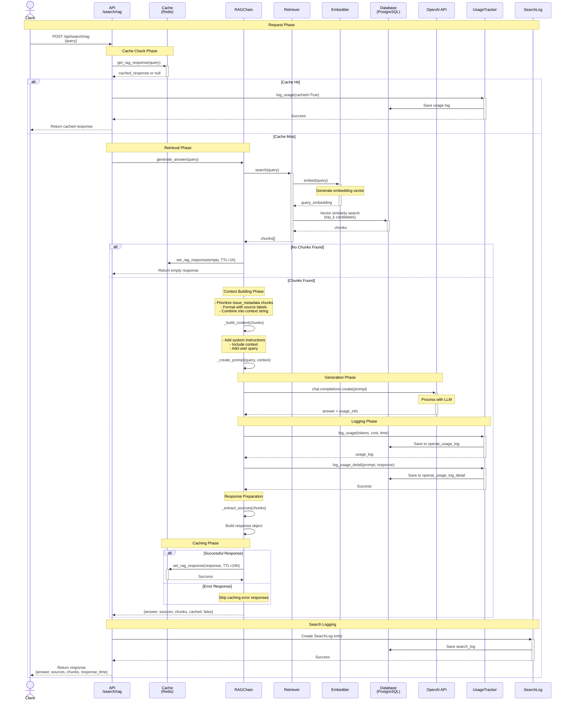

# RAG Search Sequence Diagram

Tài liệu mô tả quy trình tìm kiếm RAG (Retrieval-Augmented Generation) bằng sơ đồ tuần tự.

## Sơ đồ tuần tự (Mermaid)

## Mô tả chi tiết các bước

### 1. Request Phase
- Client gửi POST request đến `/api/search/rag` với:
  - `query`: Câu hỏi của người dùng

### 2. Cache Check Phase
- API kiểm tra Redis cache trước
- Nếu có cache hit:
  - Log usage với `cached=True`
  - Trả về response ngay lập tức
  - Không gọi OpenAI API

### 3. Retrieval Phase (nếu cache miss)
- **Embedding**: Chuyển query thành vector embedding
- **Vector Search**: Tìm kiếm trong database bằng cosine similarity (lấy top_k candidates)

### 4. Context Building Phase
- Ưu tiên chunks từ `issue_metadata`
- Format với source labels và metadata
- Tạo prompt với:
  - System instructions
  - Context từ chunks
  - User query

### 5. Generation Phase
- Gọi OpenAI API với prompt đã tạo
- Nhận về answer và usage information

### 6. Logging Phase
- Log usage vào `openai_usage_log`:
  - Tokens (input, output, total)
  - Cost (USD)
  - Response time
- Log chi tiết vào `openai_usage_log_detail`:
  - Full prompt
  - Full response

### 7. Caching Phase
- Chỉ cache successful responses (không cache errors)
- TTL: 24 giờ cho successful, 1 giờ cho empty results

### 8. Response Phase
- Trả về:
  - `answer`: Câu trả lời từ AI
  - `sources`: Danh sách nguồn tham khảo
  - `retrieved_chunks`: Chunks đã retrieve
  - `cached`: Có phải từ cache không
  - `response_time_ms`: Thời gian xử lý

## Error Handling

- Nếu không tìm thấy chunks: Trả về message thông báo
- Nếu OpenAI API lỗi: Trả về error message, không cache
- Nếu logging lỗi: Warning nhưng không ảnh hưởng response

## Performance Optimizations

1. **Caching**: Giảm thiểu API calls với Redis cache
2. **Async Logging**: Log không block response

## Database Tables Used

- `chunk`: Chứa text content
- `embedding`: Chứa vector embeddings
- `source`: Metadata của sources
- `openai_usage_log`: Log usage statistics
- `openai_usage_log_detail`: Log prompt và response chi tiết
- `search_log`: Log search history

